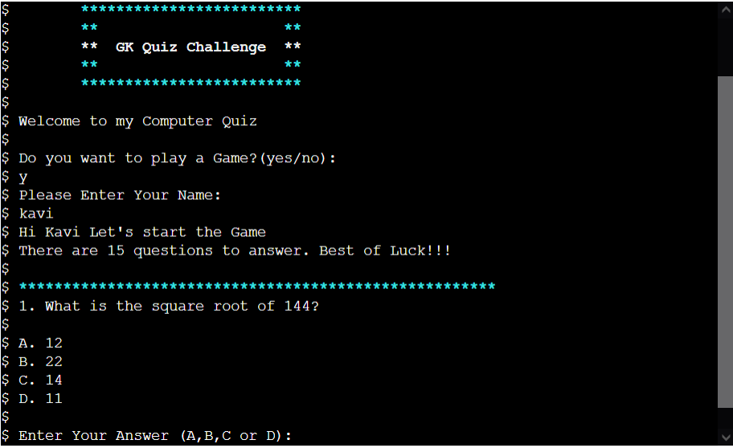
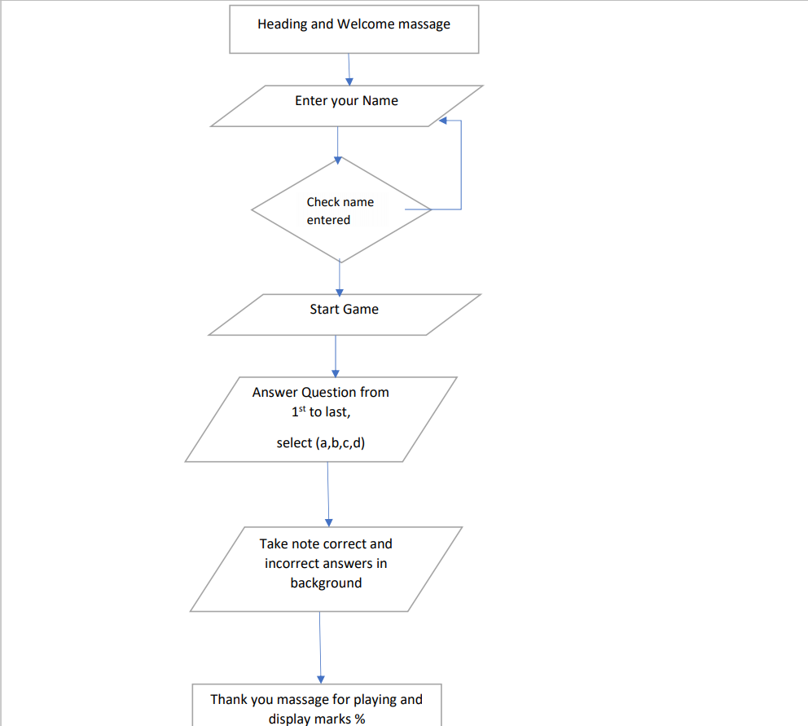
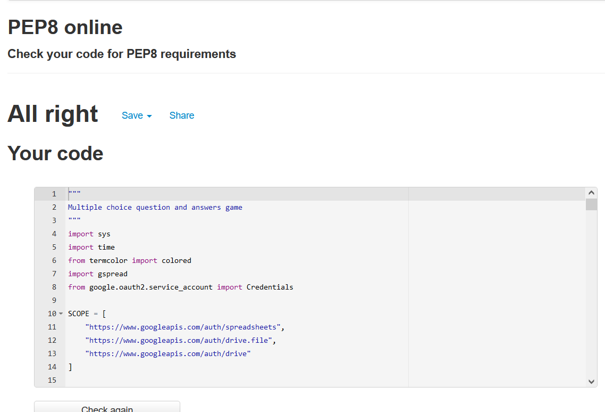

# Gk Quiz Challenge

## Types of Content

- [Introduction](#introduction "Goto Indroduction")
- [Strategy](#strategy "Goto Strategy")   
  - [UX](#ux "Goto UX")
  - [Business Vision](#business-vision "Goto Business Vision")
  - [Purpose of Website](#purpose-of-website)
- [Scope](#scope "Goto Scope")
   - [Features](#features)
   - [Future Feature](#future-feature)
- [Structure](#structure "Goto Structure")
- [Technologies Used](#technologies-used)
- [Testing](#testing)
  - [Features Testing](#features-testing)
- [Bugs](#bugs)
- [Deployment](#deployment)
- [Acknowledgement](#acknowledgement)

## Introduction
This game is designed for Users to test their General Knowledge. This game contains 15 questions from various topic.

## Strategy
Attract young people to play the game to improve their General Knowledge.
### UX
The game starts requesting the user to play the game. when the user enters "Yes" the game move to the next stage to playing the game, But the user enters "NO" the game will quit. When the User enters "YES" the game allows the user to enter his or her Name. Entering the name is important parameter in this game. The game will not go to the next stage if they not enter the Name.  After entering the name, the questions will appear for the player. The answer should be entered will be A,B,C,D either lower or upper case. If the answer is correct it will show "Correct Answer", if it is not correct it will show "Incorrect Answer".If any other characters entered the programme will prompt an error message. The error message will be "Please Enter a Valid option A,B,C,D".  After completing the 15 questions the game will prompt the final score in terms of number of questions been answer correctly as well as percentage score. It will also allow a choice for the user to play the game again.

### Business Vision

### Purpose of Website
The game is created to test the User to test their General Knowledge. This will help the kids to learn Various topics in more interesting way.

## Scope
I want younger children to play this game to improve their General Knowledge.

### Features
The game is  designed multiple choice questions. Allow the user to choose to play the game or quit the game. Four choices of answer are given for each questions. Scores are displayed as number of questions answer correctly as well as in percentage too.

### Future Features
- Add more questions from different subjects and different categories.
- Randamise questions.

## Structure
The website is designed to run a single flow. The user have to answer each question before go to the next questions.

### Flow Chart
Flow chart is used for this website.

Flow Chart

## Technologies Used:
- Python- To create Multiple choice question.
- GitHub- to save the project code and host the live  project.
- GitPod- is an open source platform for automated and ready-to-code.
- Heroku- used for deployment the app.
- Python Tutor - to check how the Python code behaves in each line.
- Google Sheet- To store name and score details. Need to create a google sheet.
- Google Cloud Platform- for activating API Credentials.
#### Activating API Credential
API will allow our Python project to access  and update data in our spreadsheet. In the Google cloud platform click on the “Select a project”  button and then select “new project”. Now let's give the project a name. Then select the "APIs and services" from the side menu, and then select “Library”. In order to access our spreadsheet, we need to enable two APIs, the first for Google Drive, where we will  get some credentials in order to securely access our Google files from the drive. And  our second API will be to Google Sheets. Then search Google Drive, followed by clicking on google drive API select enable option.  
Now, in order to connect to this API, we need to  generate some credentials. To generate our credentials we click  the “Create credentials” button. And now we have a form to fill out. 
- In the "Which API are you using"  dropdown select "Google Drive API".
- click Application data button.
- Then select i am not using them for compute engine,App engine or cloud platform.
- Then click next and then done button.
- After that Display name for Service account details
- then select create button.
- followed by select the dropdown menu Editor.
- click on continue button.
- Then go to ApIs and Services, click credential then can see a service account. Click the service account, On the next page, click on the Keys tab, then Click on the Add Key dropdown and select Create New Key. Followed by Select JSON and then click Create. This will trigger the json file with your API credentials in it to download to the computer. Then rename it creds.jsonin gitpod workspace.

## Testing
- pylint run.py - to validate python code in gitpod.
The result is ====> "Your code has been rated at 10.00/10 (previous run: 10.00/10, +0.00)"
- PEP8 Validator - To validate python code. There is no error, when i validate the code. 
    - Result
  

    
PEP8- Result

    

## Features Testing
### Actual TestCase
- The game starts requesting the user to play the game. when the user enters "yes" (upper or lower case)the game move to the next stage.when the User enters "no" (upper or lower case) or any other characters, the game will quit. 
  [Yes-To-Play](images/accept-toplay.PNG) 
  [No-To-Quit](images/reject-toplay.PNG) 
  [Any-other-Letters-To-Quit](images/reject-toplay2.PNG)
- The game allows the user to enter his or her name. If they enter the name, the questions will appear otherwise it give error message to enter the name. 
[With-Name](images/home-page.PNG) 
[Without-Name](images/name-missing-error.PNG) 
- After entering the name, the questions will appear for the User. The answer should be entered with A,B,C,D either lower or upper case. if the answer is correct it will show "Correct Answer", if it is not correct it will show "Incorrect Answer". If any other characters entered, it will give error message "Please Enter a Valid option A,B,C,D". 
[Correct-Answer](images/correct-answer.PNG) 
[InCorrect-Answer](images/incorrect-answer.PNG) 
[If-Enter-Anyother-Characters](images/invalid-answer.PNG)
- After completing 15 questions the game will prompt the final score in terms of number of questions been answer correctly as well as percentage Score. 
[Quiz-Result](images/quiz-result.PNG) 
- The game will also allow a choice the user to play the game again or quit the game. They can enter "yes, y, no, n" lower or upper case.if they enter any other characters it will show error message that"Please Enter Valid option(yes or no). 
[Restart-Game](images/play-again.PNG) 
[Quit-The-Game](images/rejection-of-play.PNG) 
[If-Enter-Any-other-Characters](images/invalid-characters.PNG) 
- Name and scores will automatically stored in google sheet after finishing the game. 
[Google Sheet](images/google_sheet.PNG)

## Bugs
- I would like to randamise the questions, but did not manage to get it right.
- I had lot of difficulties to getting the name and score data transferred and stored in Google spreadsheets. 

## Deployment
First we need to go to github website the create a new repositary using code Institute- python Essential Template. Followed by giving a new name of the website.Then need to click the create repositary button. After click the button it will bring us to go to another page, which contains the green button labelled as Gitpod.Click the Gitpod button will bring us to the Gitpod Workspace for coding screen.

#### Gitpod

Used Gitpod Workspace for coding. To preview the browser window need to type "python3 run.py" in the terminal window at the bottom.Afterthat, have to do git add for add files or remove files and do git commit for reasoning and do the git push for git hub repositary website. 

#### Procedure for deployment
Need to add a new line character at the end of the text inside the input method. Without this extra line, the text for the import
request will not show up in the terminal. To create our list of requirements, we use the following command in the gitpod terminal. 
'pip3 freeze > requirements.txt' 
Now requirements.txt file has been updated. Heroku will use this list to install these things in to the application before the project code runs.

#### Using Heroku
1. Sign up in to Heroku.
2. Create a App name and choose the region.
3. Go to settings tab and select config vars then type keys to CREDS and in the value field Creds.json file need to paste from the gitpod. Then select buildpack then select python and then node.js and click on save changes.
4. Then click to deploy tab and select GitHub.
5. Then search for the app name and connect it from github repository. Then select deploy branch for Manual Entering. The software will build the log and display the successful deployment message.Then we can view the app option.

## Acknowledgement
- I would like to thank my mentor Rohit Sharma and my tutors Kasia for their helpfulness, constructive feedback and guidance when needed.
- I would like to thank the staff and students of Code Institute for their help.
- I also like to thank Slack Community for sharing the open discussion from various students.
- I search lots of information from Google, W3 School and Youtube for this project.
- Reference taken from this videos
https://www.bing.com/videos/search?q=Python+Games+for+Beginners&&view=detail&mid=BFA54B4759D1B362B813BFA54B4759D1B362B813&&FORM=VRDGAR&ru=%2Fvideos%2Fsearch%3Fq%3DPython%2BGames%2Bfor%2BBeginners%26Form%3DVDRSCL%26%3D0
https://www.youtube.com/watch?v=-I96VIIiIXk
https://www.youtube.com/watch?v=yriw5Zh406s&t=63s

